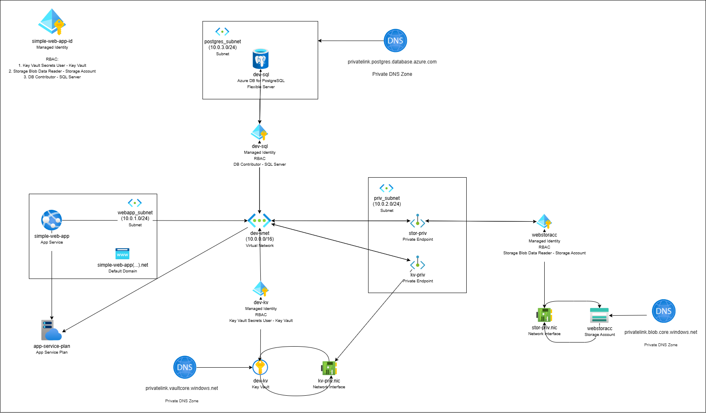

# Azure Web App deployment using Terraform
In this demo project I will be creating a web app using Terraform (IaC) on Microsoft Azure. 

# Diagram
This is a demo diagram I have created to start working on the project. It will change and it will certainly get better. ☺️

# To-do tasks 
1. Create a resource group with the name "rg-kalliopi-tsiampa" on Azure [x]
2. Create a Virtual Network (Vnet) with the name "demoVnet" [x]
3. Create a Storage Account with the name "azdemostoracc" [x]
4. Create subnets, one for the web app (webapp_subnet), one for the sql database (db_subnet), one for the keyvault (keyvault_subnet) []
5. Create Private Endpoints to ensure privacy and block unauthorized access. []
6. Use Role Based Access (RBAC) to allow access to whomever needs it and block access from others []
7. Connect the different resources with each other correctly []

